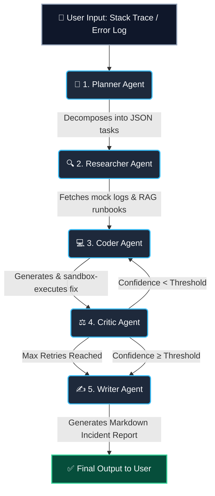

# 🚨 NexusAI Ops: Autonomous SRE Incident Responder
### *Not a general-purpose chatbot. A vertical, self-correcting AI agent built exclusively for SRE (Site Reliability Engineering) incidents.*

<p align="center">
  
  
  
  
  
  
  
</p>

<p align="center">
  <a href="https://nexus-aivs.vercel.app" target="_blank"><strong>🌐 View Live Demo</strong></a> •
  <a href="https://nexus-ai-8155.onrender.com/docs" target="_blank"><strong>⚙️ API Documentation</strong></a> •
  <a href="#-quick-start"><strong>🚀 Local Setup</strong></a>
</p>

---

## ⚠️ Important: This is NOT a General-Purpose Chatbot

| ✅ **What this project IS** | ❌ **What this project is NOT** |
| :--- | :--- |
| Diagnosing `ConnectionPoolError` in Redis | Answering "What is the capital of France?" |
| Resolving `deadlock detected` in PostgreSQL | Writing a poem about the ocean |
| Fixing `OOMKilled` in Kubernetes pods | Generating generic business advice |
| Resolving `AccessDenied` on S3 buckets | Having a casual conversation about sports |

**If you send a generic prompt (e.g., "Hello", "Tell me a joke", "What is AI?"), the system will return a clarification request or a generic report. This system is engineered exclusively for SRE/DevOps infrastructure scenarios.**

---

## 🌟 Why This Project Exists

Most AI agents hallucinate on vague production errors and act as "black boxes." **NexusAI Ops** was built to solve this problem for SRE teams by:

1. **🛡️ Self-Correcting Critic Loop:** A dedicated evaluator agent reviews all generated code fixes. If confidence is low, it forces a rewrite. If it fails twice, it gracefully synthesizes a best-effort report.
2. **⚡ Hardware-Aware Model Routing:** Dynamically routes simple parsing to lightweight models (`Llama 3.1 8B` via Groq) for <2s latency, and complex debugging to heavy reasoning models (`Llama 3.3 70B`) with Chain-of-Thought prompting.
3. **🔍 Full Explainability:** Every response includes an interactive "Execution Trace" timeline, showing exactly what the Planner, Researcher, Coder, and Critic did at each step.
4. **🏗️ Enterprise-Ready Infrastructure:** Fully containerized via Docker, mapped to Kubernetes manifests, and structured with strict Pydantic schemas for Model Context Protocol (MCP) compliance.

---

## 🏛️ System Architecture: "The Precision Loop"

NexusAI Ops is powered by a stateful **LangGraph** workflow with strict conditional routing.



---

## 🗺️ Roadmap & Future Improvements

This project is actively evolving. Here is the 5‑phase roadmap for production hardening and feature expansion:

### Phase 1: Production‑Grade RAG (Real Knowledge Retrieval)
- **Now:** Uses mock dictionary (`MOCK_RUNBOOKS`) for runbook retrieval.
- **Future:** Replace with a real Vector Database (Pinecone, Chroma, or pgvector) to semantically search thousands of historical runbooks and stack traces.
- **Impact:** Significantly reduces hallucination by grounding the agent in your actual company documentation.

### Phase 2: Real‑Time Observability Integration
- **Now:** Fetches static mock logs.
- **Future:** Integrate with real observability tools via APIs:
  - **Prometheus** – Fetch live metrics and alert data.
  - **Datadog/Splunk** – Pull real log lines for the affected service.
  - **AWS CloudTrail** – Audit IAM and permission changes.
- **Impact:** Transforms the agent from a "simulator" into a truly actionable production tool.

### Phase 3: Active Remediation (The "Shell Agent")
- **Now:** The Coder generates a Python script that prints the fix commands.
- **Future:** Add a dedicated **"Executor Agent"** that can:
  - Run `kubectl apply -f` or `aws s3 cp` commands directly (with user approval).
  - Generate Terraform/Ansible patches for infrastructure‑as‑code rollbacks.
- **Impact:** Reduces Mean Time to Resolution (MTTR) from minutes to seconds.

### Phase 4: Advanced Evaluation Suite
- **Now:** `eval_suite.py` tests 10 enterprise scenarios.
- **Future:** Scale to **50+ scenarios** and integrate with:
  - **RAGAS / DeepEval** – For automated hallucination scoring.
  - **Arize Phoenix** – For LLM observability and tracing.
- **Impact:** Makes the system **auditable** and **continuously validated** in CI/CD.

### Phase 5: Multi‑Tenant UI & Authentication
- **Now:** Single user, in‑memory chat history.
- **Future:**
  - Add authentication (Clerk, Auth0, or Supabase).
  - Persist chat history per user in PostgreSQL.
  - Add team collaboration features (share incident reports).
- **Impact:** Turns this into a deployable, internal SaaS tool.

---

## 🛠️ Technology Stack

| Layer | Technologies |
| :--- | :--- |
| **Orchestration** | LangGraph (State Machine), LangChain |
| **LLMs (Cloud/Live)** | Groq API (`llama-3.1-8b-instant`, `llama-3.3-70b-versatile`) |
| **LLMs (Local/Dev)** | Ollama (`qwen2.5:3b`, `phi3:3.8b`) |
| **Backend API** | Python 3.11, FastAPI, Uvicorn, Pydantic |
| **Frontend UI** | React 19, TypeScript, Vite, Tailwind CSS, Framer Motion |
| **State Management** | Zustand (Frontend threads), LangGraph `InMemorySaver` |
| **Infrastructure** | Docker Compose, Kubernetes Manifests (Deployment/Service) |
| **CI/CD** | GitHub Actions (PyTest, TypeScript Lint/Build) |
| **Deployment** | Vercel (Frontend), Render (Backend API) |

---

## 🚀 Quick Start

### Prerequisites
- [Ollama](https://ollama.com/) installed and running locally (for local dev).
- Python 3.11+ and Node.js 18+.

### 1. Clone the Repository
```bash
git clone https://github.com/johnvarshith/Nexus-AI.git
cd Nexus-AI
```

### 2. Backend Setup
```bash
cd backend
python -m venv venv
source venv/bin/activate  # Windows: venv\Scripts\activate
pip install -r requirements.txt

# Run from the project root (recommended)
cd ..
python -m uvicorn backend.main:app --reload --port 8000
```
> **Important:** Always run the backend from the **project root** (`Nexus-AI/`), not from inside `backend/`, to avoid `ModuleNotFoundError`.

### 3. Frontend Setup
```bash
cd frontend
npm install
npm run dev
```
Visit `http://localhost:5173` to access the Dark Glass dashboard.

### 4. One‑Click Docker Deployment (Alternative)
```bash
# From the project root
docker-compose up --build
```
> **Note:** Requires Ollama running on your host machine (`host.docker.internal` trick is used).

### 5. Environment Variables
Copy `.env.example` to `.env` and configure:
```env
# Required for local dev
OLLAMA_BASE_URL=http://localhost:11434

# Required for cloud deployment (Render)
USE_CLOUD_LLM=True
GROQ_API_KEY=gsk_...
GROQ_FAST_MODEL=llama-3.1-8b-instant
GROQ_DEEP_MODEL=llama-3.3-70b-versatile
```
> **Never commit your `.env` file to GitHub.**

---

## 📊 Performance & Evaluation Metrics

We don't just guess; we measure. The included `eval_suite.py` tests the agent against 10 complex, multi-line enterprise SRE scenarios (Redis timeouts, DB deadlocks, OOM kills, K8s failures).

| Metric | Achieved Value |
| :--- | :--- |
| **Eval Suite Accuracy** | **80%+** across complex enterprise scenarios |
| **Fast Mode Latency** | **~1–2 seconds** (Llama 3.1 8B via Groq) |
| **Deep Mode Latency** | **~3–4 seconds** (Llama 3.3 70B via Groq) |
| **Hallucination Rate** | Minimized by the Critic self-correction loop |

---

## 🎬 How to Demo This Project

To see the self-correcting loop in action, **use only SRE-specific prompts**. Here are examples that work:

| ✅ Good Prompt (Works) | ❌ Bad Prompt (Will Fail) |
| :--- | :--- |
| `"checkout-service ConnectionPoolError max connections reached"` | `"Hello, how are you?"` |
| `"PostgreSQL deadlock detected on orders table"` | `"Tell me a joke"` |
| `"api-gateway OOMKilled memory limit 512Mi"` | `"What is the meaning of life?"` |
| `"Kubernetes CrashLoopBackOff due to torch module missing"` | `"Write a poem"` |

**Live Demo Instructions:**
1. Open the live UI: `https://nexus-aivs.vercel.app`
2. Toggle **Deep Think** mode to see the model badge change.
3. Type an SRE prompt from the "Good Prompt" list above.
4. Watch the **right sidebar** – it will show the agent reasoning live.
5. Click **"Show Execution Trace"** on the final response to see the step-by-step agent reasoning (Planner → Researcher → Coder → Critic → Writer).

---

## 🧪 Troubleshooting Common Issues

| Issue | Solution |
| :--- | :--- |
| **Render build fails with `mcp==0.2.0 not found`** | Remove `mcp` from your `requirements.txt`. The live demo does not require it. |
| **Backend returns `ModuleNotFoundError: No module named 'backend'`** | Run the backend from the **project root** (`python -m uvicorn backend.main:app`), not inside the `backend/` folder. |
| **Vercel deployment fails** | Set the Root Directory to `frontend` and the Build Command to `npm run build`. |
| **Groq API key invalid** | Generate a new key at `console.groq.com/keys` and update `.env` / Render environment variables. |

---

## 🏗️ Infrastructure & DevOps

This project is built with production scalability in mind:
- **Docker:** Multi-stage builds for optimized image sizes.
- **Kubernetes:** Includes `infra/k8s/` manifests featuring `replicas: 3`, resource limits, and HTTP `livenessProbe`/`readinessProbe` configurations.
- **CI/CD:** GitHub Actions automatically run `pytest` and TypeScript builds on every push to `main`.
- **MCP Compliance:** Tools are defined with strict Pydantic `input_schema` models, making them ready for enterprise Model Context Protocol registries.

---

## 📁 Project Structure (Key Files)

```
nexusai/
├── backend/
│   ├── agents/                # The 5 LangGraph agents
│   │   ├── graph.py           # State machine & routing
│   │   ├── planner.py
│   │   ├── researcher.py
│   │   ├── coder.py
│   │   ├── critic.py
│   │   └── writer.py          # (inside graph.py)
│   ├── llm_factory.py         # Routes between Ollama & Groq
│   ├── main.py                # FastAPI entrypoint
│   └── requirements.txt
├── frontend/
│   ├── src/
│   │   ├── components/
│   │   │   ├── ChatHistory.tsx
│   │   │   ├── AgentTraceTimeline.tsx
│   │   │   └── LiquidGlassCard.tsx
│   │   ├── store/
│   │   │   └── useChatStore.ts
│   │   └── App.tsx
│   └── package.json
├── infra/
│   ├── docker/                # Dockerfiles
│   └── k8s/                   # Kubernetes manifests
├── eval_suite.py              # Automated test harness
└── docker-compose.yml
```

---

## 🤝 Contributing

Contributions, issues, and feature requests are welcome! Feel free to check the [issues page](https://github.com/johnvarshith/Nexus-AI/issues).

## 📜 License

Distributed under the MIT License. See `LICENSE` file for more information.

---

<p align="center">
  <sub>Built with ❤️ by <a href="https://github.com/johnvarshith">Varshith</a></sub>
</p>
```


